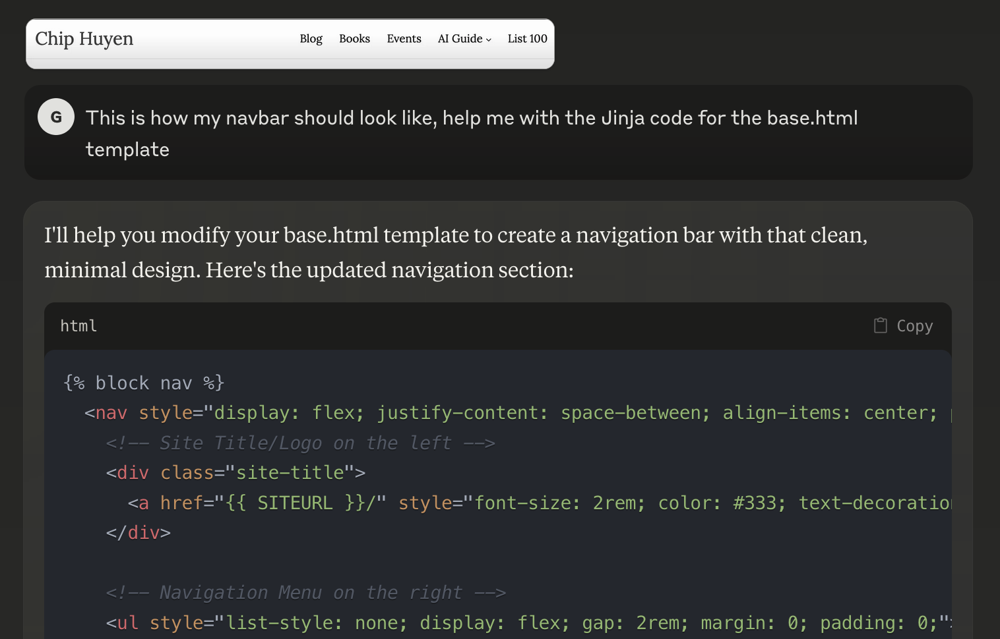

Title: Using AI to write about AI
Date: 2025-02-02 13:00
Modified: 2025-02-02 13:00
Category: Python
Tags: pelican, publishing
Slug: ai-for-writing-about-ai
Authors: Gonzalo Rubio-Casas
Summary: TBD
Status: Draft

On the process of building this blog, I was 100% sure I wanted to follow [Ben Kuhn’s advice](https://www.benkuhn.net/writing/#set-up-your-blog) and spent as little time as possible with the set-up.

Another requirement I had was that the content should be owned as tightly as possible by me, this means that the content need to be produced in a fully portable format (text files, Markdown, or similar)

For that reason and because I have a lot of previous exposure to Python and Jinja decided to give Pelican a try. In the past I have tinkered with it, but ended up stuck in trying to make the theme to behave as I needed or stuck into the best build process of the site.

This time is different, this time I have the flexibility to use my own theme, and I am 100% confident I will get it to work as I need because I have AI to help me.

I am no expert in HTML, CSS or JS, but I am really good at understanding how all those languages are structured and built, so with AI helping with the syntax I can build almost anything I can dream of.

So I found [Chip Huyen's blog](https://huyenchip.com/) design pretty neat, so let us say I want to use that as a base inspiration and then tweak it a bit:

Boom! I can literally screenshot the site and get a working CSS. It needs some adjustments to make sure the code is organized and works for my specific set-up but it saves me a huge time on:

* Building a skeleton to iterate until I get the desired result
* Learning all the CSS syntax that I will literally use once in my life (building the template)

But, how is this even possible? If LLM are just probabilistic machines, how can they take images and produce a CCS that replicates it?

What will happen if I feed an image that has absolutely nothing to do with CSS styling? Why?